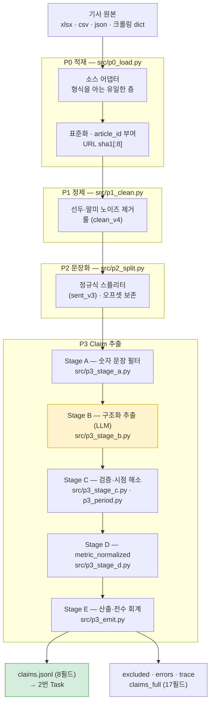
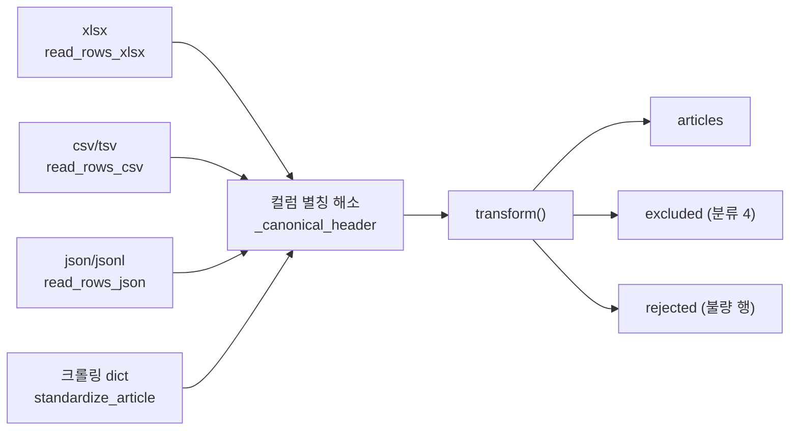
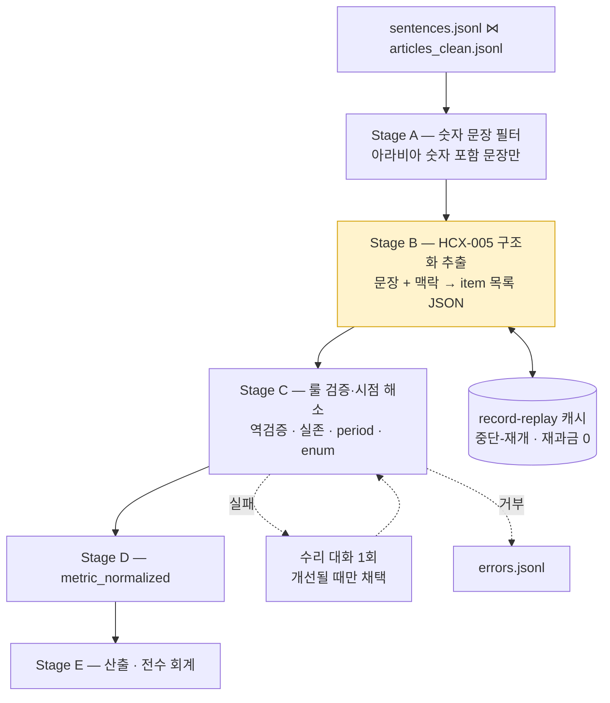
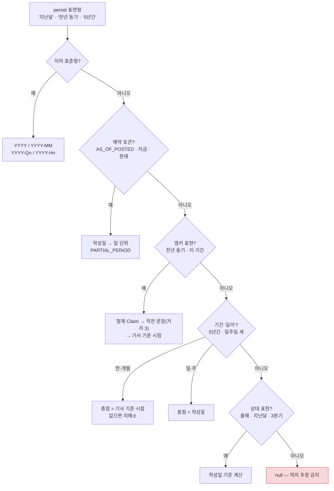

# 코드 안내 (CODE GUIDE)

> **이 문서의 목적** — 저장소를 처음 보는 사람이 "무엇이 어떤 순서로 돌아가는지"를 30분 안에 파악하고, 직접 실행하고, 안전하게 고칠 수 있게 하는 것.
> 팀 계약·의사결정 이력은 별도 문서(`CLAUDE.md`)에 있고, 이 문서는 **코드만** 다룬다.

---

## 0. 30초 요약

```
뉴스 기사 원문  ──►  [P0 적재]  ──►  [P1 정제]  ──►  [P2 문장화]  ──►  [P3 Claim 추출]  ──►  claims.jsonl
   xlsx/csv/json      표준 5필드      노이즈 제거       문장 단위          수치 주장 8필드         (2번 Task 입력)
```

- **하는 일**: 뉴스 기사에서 **검증 가능한 수치 주장(Claim)** 을 뽑아 구조화한다. "2025년 1월 취업자 수는 13만 명 감소했다" → `{metric: 취업자 수, value: 13만, unit: 명, period: 2025-01, …}`
- **하지 않는 일**: KOSIS 검색·통계 조회·참/거짓 판정. 그건 2~5번 Task의 몫이다.
- **핵심 원칙**: 결정적인 일(정제·문장 분리·시점 계산·검증)은 **룰**, 의미 이해만 **LLM**. 숫자가 든 문장은 **하나도 빠짐없이** Claim이거나 제외 기록이거나 오류 기록이어야 한다(전수 회계).

| | |
|---|---|
| 언어·런타임 | Python 3.14 (venv) |
| 외부 의존성 | `openpyxl`(엑셀 읽기) · `pytest`(테스트) — **그 외 없음** |
| LLM | NCP CLOVA Studio **HCX-005** (Stage B 한 곳에서만 호출) |
| 테스트 | **261개** (`pytest -q`) |
| 코드 규모 | `src/` 18개 모듈 · 약 3,000줄 |

---

## 1. 빠른 시작

### 1.1 설치

```bash
python -m venv venv
venv\Scripts\python.exe -m pip install -r requirements.txt
```

### 1.2 `.env` 만들기 — **비밀키는 여기서만 관리한다**

```bash
copy .env.example .env
```

`.env`를 열어 값을 채운다. 변수명은 `.env.example`이 정본이다.

| 변수 | 필수 | 쓰는 곳 |
|---|---|---|
| `NCP_CLOVASTUDIO_API_KEY` | ✅ | 1번 Stage B (HCX 호출) |
| `KOSIS_API_KEY` | ✅ | 2~5번 Task (이 저장소는 미사용, 통합 시 변수명 통일 목적) |
| `HCX_ENDPOINT` · `HCX_MODEL` | — | 엔드포인트·모델 교체 시에만 |
| `PART1_DIR` | — | 골든셋·기사 원본 폴더 (기본 `D:/part1`) |
| `DATA_DIR` · `CACHE_DIR` | — | 산출물·캐시 위치 변경 시에만 |

> **`.env`는 `.gitignore`가 차단한다.** `.env.example`만 커밋된다(값은 비어 있음).
> 코드는 `src/config.py`를 통해서만 키를 읽고, **값을 로그·예외 메시지에 절대 싣지 않는다.**
> `.env`가 OS 환경변수를 **덮어쓴다** — "`.env`를 고쳤는데 왜 안 바뀌지"를 원천 차단하기 위한 의도적 선택이다.

### 1.3 실행 — 입력 3가지 시나리오

**(a) 선별 기사 60건 (개발·평가용, xlsx)**

```bash
venv\Scripts\python.exe -m src.p0_load --input D:/part1/articles.xlsx --outdir data
```

**(b) 크롤링 원본 전량 (조선일보 news.csv 2,707건)**

```bash
venv\Scripts\python.exe -m src.p0_load --input D:/part1/news.csv --outdir data/bulk
```

**(c) 크롤링 기사 1건 (실서비스 경로, json)**

```bash
venv\Scripts\python.exe -m src.p0_load --input crawled.json --outdir data/one
```

이후는 입력 형식과 무관하게 동일하다:

```bash
venv\Scripts\python.exe -m src.p1_clean
venv\Scripts\python.exe -m src.p2_split
venv\Scripts\python.exe -m src.p3_stage_b --dev-run
```

평가(골든셋이 있을 때만):

```bash
venv\Scripts\python.exe -m src.p1_eval
venv\Scripts\python.exe -m src.p2_eval
venv\Scripts\python.exe -m src.p3_eval --self-check
venv\Scripts\python.exe -m src.p3_stage_c --passthrough
venv\Scripts\python.exe -m pytest -q
```

---

## 2. 파이프라인 한 장



> 노란 칸(**Stage B**)이 이 저장소에서 **LLM을 호출하는 유일한 지점**이다. 나머지는 전부 결정적 룰이라 같은 입력 → 항상 같은 출력이다.

### 단계별 산출물

| 단계 | 산출 파일 | 내용 |
|---|---|---|
| P0 | `data/articles.jsonl` | 표준 기사 — `article_id · title · posted_date · url · text` |
| | `data/aux_labels.csv` | 보조 라벨 사이드카(작업용 분류·검색어 등, url로 조인) |
| | `data/articles_excluded.jsonl` | 분류 4(크롤링 오류) 제외 기록 |
| | `data/articles_rejected.jsonl` | **bulk 정책에서 격리된 불량 행** (거부 0건이면 생성 안 함) |
| P1 | `data/articles_clean.jsonl` | 정제 본문 — 원본과 **같은 5필드**라 그대로 교체 사용 가능 |
| | `data/articles_clean_trace.jsonl` | 무엇을 왜 지웠는지(`removed_spans`) — 감사용 사이드카 |
| P2 | `data/sentences.jsonl` | 문장 단위 — `sent_id · text · start · end` |
| P3 | **`claims.jsonl`** | **공식 인수인계 8필드** |
| | `claims_full.jsonl` | 내부 표준 17필드(value_type·direction 등 포함) |
| | `excluded.jsonl` | 제외 대장(사유 코드) |
| | `errors.jsonl` | 추출·검증 실패(사람 검토 큐) |
| | `claims_trace.jsonl` | 계보 — 오프셋·시점 해소 방법·감사 플래그 |

---

## 3. 단계별 상세

### P0 — 적재 (`src/p0_load.py`)

원본이 무엇이든 **표준 기사 5필드**로 바꾼다. **입력 형식을 아는 층은 여기뿐**이라, 입력이 xlsx → csv → 크롤링으로 바뀌어도 P1~P3는 손대지 않는다.



**핵심 규칙**

| 규칙 | 내용 |
|---|---|
| `article_id` | `"A" + sha1(url.strip().rstrip("/"))[:8]` — 기사를 추가·삭제·재정렬해도 **같은 기사는 항상 같은 ID** |
| 컬럼 별칭 | `기사제목`/`title`, `작성일`/`posted date`, `기사 본문 전체`/`text` … 를 모두 흡수(대소문자·공백·언더스코어 무시) |
| 작성일 정규화 | `2025.06.23. 14:52` · `2025-06-23T09:00Z` · `2025년 6월 23일` → 전부 `2025-06-23`. 해석 불가는 **에러**(억지 추정 금지) |
| 본문 무수정 | `text`는 `strip`조차 하지 않는다 — 정제는 P1 소관(원본 보존 원칙) |
| 인코딩 | csv·json 모두 기본 `utf-8-sig`(→ cp949 폴백). Windows 도구가 붙이는 **BOM**을 흡수한다 — `utf-8`로 읽으면 BOM 하나에 JSON 파싱이 통째로 실패한다 |
| ID 교차 검증 | 파일에 `article ID`가 적혀 있으면 URL 계산값과 **일치해야** 한다(수기 오류 방어) |

**적재 정책 2종** — 이게 xlsx와 csv를 가르는 핵심이다.

| 정책 | 기본 적용 | 불량 행을 만나면 |
|---|---|---|
| `strict` | xlsx (선별 60건) | **전체 실패**. 전 행의 사유를 모아 `ValueError` — 부분 산출 금지 |
| `bulk` | csv · json (대량·크롤링) | `articles_rejected.jsonl`로 **격리**하고 계속 |

> **왜 나눴나**: `news.csv` 실측에서 필드 밀림 1행·중복 URL 10건 등 크롤링 아티팩트가 존재한다. "전부 아니면 전무"를 적용하면 2,707건이 통째로 죽는다. 격리도 **기록**이므로 전수 회계는 그대로 유지된다:
> `len(articles) + len(excluded) + len(rejected) == len(rows)` (assert로 강제)
>
> 실측: `입력 2707건 = 적재 2695건 + 제외 0건 + 거부 12건`

`temporary classification`(1번의 작업용 수기 분류)은 **strict에서만 필수**다. 크롤링 기사에는 존재하지 않는 라벨이기 때문이다.

### P1 — 정제 (`src/p1_clean.py`, `clean_v4`)

크롤링 본문에 붙은 UI 노이즈를 제거한다. 규칙은 손으로 만든 정답본 52건을 역산해 도출했다.

| 위치 | 규칙 |
|---|---|
| 선두 | `입력 2025.06.23. 09:03 업데이트 … 0` 타임스탬프 앵커 · 뉴스레터형(`604호 2025.09.15 11:00`) · 타임스탬프 없는 기사용 `섹션+제목` 폴백 |
| 말미 | UI 전용 앵커 13종(`English 기사보기` · `오늘의 핫뉴스` · `많이 본 뉴스` · `당신이 좋아할 만한 콘텐츠` · 해시태그 블록 · 기자 프로필 …) 중 **가장 이른 위치**부터 끝까지 절단 |
| 꼬리 | 마지막 문장 종결 이후의 짧은 무종결 꼬리(태그 키워드·기자명) 휴리스틱 |
| 중간 | **건드리지 않는다** — `[칼럼 전문 링크]`·`<사진>`·`[편집자주]` 같은 기사 고유 마커는 특수 사례라 규칙화하지 않는다 |

> **말미 제거가 중요한 이유**: 추천 기사 블록 안에 **진짜 통계 수치**가 들어 있다("원·달러 환율 1477.2원 마감"). 지우지 못하면 Stage A가 이걸 후보로 잡아 **남의 기사 수치로 가짜 Claim**을 만든다.

**보존 인바리언트**: `정제본 + removed_spans == 원문`. 코드가 자동 검사한다 — 무손실은 보장하지만 정확성은 보장하지 않으므로, 정확성은 골든셋 채점(`p1_eval`)이 담당한다. 현재 **52/52 완전 일치**.

### P2 — 문장화 (`src/p2_split.py`, `sent_v3`)

정규식 스플리터. `kss` 6.0.6과 동일 조건에서 비교한 뒤 채택했다(F1 97.4% vs 94.2%, 속도 0.1초 vs 253초).

설계: **경계 후보를 넓게 찾고 → 보호 필터로 가짜를 걸러내고 → 절단 → 검산**

| 요소 | 내용 |
|---|---|
| 종결형 후보 | `[.!?]` + 닫는 따옴표·괄호(0~2) + **공백**. 공백을 요구하기 때문에 소수점(`1.0%`)은 애초에 후보가 되지 않는다 |
| 기호형 후보 | 공백 뒤의 `◇ ☞ ▲ ▷` 앞 — 개행이 크롤링에서 소실돼 **무종결 소제목**을 가를 신호가 이 기호뿐이다 |
| 보호 필터 | 따옴표·괄호 열림 상태 추적. 따옴표는 짝 맞춤이 아니라 **토글** — 닫는 따옴표를 여는 모양(`“`)으로 쓴 기사가 실재해서, 짝 맞춤은 "영원히 열림"에 갇힌다 |
| `…`/`...` 제외 | 칼럼 제목의 말줄임(`그만… 판사는`)을 종결로 오인해 과잉 절단되던 실측 사례 |
| 오프셋 | 정제본 기준 `[start, end)` — `text[start:end] == 문장`이 항상 성립 |

**보존 인바리언트**: 정제본의 모든 비공백 문자는 **정확히 한 문장**에 속한다.

### P3 — Claim 추출

여기가 이 저장소의 본체다. 5단계로 나뉘고, LLM은 Stage B 하나뿐이다.



#### Stage A — 숫자 문장 필터 (`p3_stage_a.py`)

아라비아 숫자를 포함한 문장만 후보로 삼는다. Recall 우선 — **여기서 놓친 문장은 뒤에서 되살릴 수 없다.**
(한글 수사만 있는 문장을 별도로 재검색해 실질 누락이 없음을 확인했다.)

#### Stage B — 구조화 추출 (`p3_stage_b.py`) — **유일한 LLM 호출**

| 항목 | 내용 |
|---|---|
| 모델 | HCX-005 (긴 컨텍스트) |
| 입력 | 제목 + `posted_date` + **대상 문장** + 맥락(앞 2·뒤 2문장 + 기사 리드) + **기사 단위 시점 앵커**(조사 기간·기준일 문장을 룰로 선추출해 첨부) |
| LLM이 채우는 것 | `kind` · `exclusion_code` · `forecast(Y/N)` · `metric` · `value` · `unit` · `value_type` · `direction` · `comparison_basis` · **`period` 표면형** · `note` |
| LLM이 하지 **않는** 것 | **날짜 계산**. "지난달"은 그대로 넘기고 절대 시점 계산은 Stage C의 룰이 한다 |
| 출력 순서 | **원문 등장 순서**가 계약(Stage C가 검사) |
| 프롬프트 | `src/prompts/extract_v1.txt` — 버전 상수 `PROMPT_VERSION`으로 관리, 캐시 키에 포함 |

**3단 파서** — 실측 기형 2종을 결정적으로 회수한다(전부 HCX 재호출 0회):

1. 엄격 JSON 파싱
2. 결정적 수리(객체 닫힘 중복 `"}}]` 등 — 평면 스키마 전제)
3. 고정 키 관용 스캐너(문자열 안 비이스케이프 따옴표 대응 — 키 위치로 필드 절단)

**재시도 3단**: ① 수리 대화(오류 필드 피드백) → ② `temperature 0.5` 재샘플 → ③ 예외(파이프라인이 `EXTRACTION_ERROR`로 회계).
`temperature 0` 동일 재시도는 **금지** — 같은 실패를 복제할 뿐이다.

**record-replay 캐시** (`p3_cache.py`): 키 = `(prompt_version, model, params, payload 해시)`. 같은 프롬프트로 재실행하면 **재과금 0**이고, 룰만 고쳤을 때 LLM 출력을 고정한 채 회귀 검증할 수 있다.
수리 호출은 payload 끝에 `[STAGE_C_REPAIR] {피드백}`을 붙여 **원 호출과 캐시 키를 일부러 분리**한다 — 같은 문장이 원본·수리 두 종류로 각각 녹화된다.

**서킷브레이커**: 오류 문장 비율이 임계(운영 기본 3%)를 넘으면 개별 문제가 아니라 **프롬프트/파서의 계통 결함**으로 보고 파이프라인을 중단한다.

#### Stage C — 룰 검증 (`p3_stage_c.py` + `p3_period.py`)

LLM 출력을 믿지 않고 전부 검사한다. **파괴적 검사**(통과 못 하면 Claim 폐기)와 **감사 플래그**(기록만)를 명확히 나눈다.

| 검사 | 성격 | 내용 |
|---|---|---|
| **역검증** | 파괴적 | `value + 공백(0~1) + unit` 결합 문자열이 **문장 안에 실존**해야 한다. **왼쪽 숫자 경계**를 요구해 `8.3%`에서 `3%`를 잘라내는 환각을 차단 |
| **metric 구성 어휘 실존** | 파괴적 | metric의 각 단어가 **기사 전체**에 존재해야 한다. 조합은 허용(`반도체`+`수출`→`반도체 수출`), 없는 단어 창작은 금지 |
| kind × code 정합 | 파괴적 | `kind=claim`인데 제외 코드가 붙는 모순 차단 |
| enum 검사 | 파괴적 | `value_type` · `direction` · `exclusion_code`의 계약 밖 값 차단 |
| `direction` | 룰 우선 | 단, **증감형(`change_rate`·`change_amount`)에서만** 채운다 |
| `value_type` | 감사 | 룰 1차 분류기와 LLM 판정을 대조해 불일치를 trace에 플래그 |
| `forecast` | 감사 | **LLM 우선**. 사전 어휘가 있는데 N인 경우가 실재하므로 룰의 자동 승격은 금지 |

**period 해소** (`p3_period.py`) — 이 저장소에서 가장 규칙이 촘촘한 부분이다.



원칙은 하나다 — **틀린 값을 만드느니 `null`.** 불가능한 날짜·역전된 범위·무효 앵커는 전부 반려한다. 시점이 틀리면 뒷 단계의 조회가 통째로 틀리기 때문이다.

주요 규칙(작성일 기준):

| 표면형 | 결과 |
|---|---|
| 올해 / 금년 | 작성일 연도 |
| 지난해 / 작년 / 전년 | 연도 − 1 |
| 이달 / 지난달 | 작성일 연-월 / 월 − 1 (**연 경계 처리**: 1월 기사 → 전년 12월) |
| 지난 1월 | 작성일 이전 가장 가까운 그 달 |
| 3분기 / 상반기 | `YYYY-Q3` / `YYYY-H1` |
| 연말 / ~말 | **연 단위로만** (월 특정 안 함) |
| 전년 동기 | **형제 Claim의 시점에서 −1년** (작성일 기준이 아니다) |
| 이 기간 / 당시 | 앵커를 **시프트 없이** 상속 |
| 6월 1~20일 | 확장형 유지 + `PARTIAL_PERIOD` → 계약 사영 시 `null` |
| 최근 / 향후 | `null` |

> **앵커 상속에서 가장 조심할 것**: 앵커 항목이 *이미 시프트된* 값을 다시 앵커로 잡으면 **−1년이 누적**된다(실측: 한 문장의 3분기 3개가 2024·2023·2022-Q3로 흩어짐). 그래서 pass1 결과의 **스냅샷**에서만 앵커를 찾는다. 이 구조를 모르고 고치면 조용히 재발한다.

#### Stage D — `metric_normalized` (`p3_stage_d.py`)

2번 Task의 확장 씨앗이 될 표준 지표명. **현재 동작은 "verbatim metric 그대로 복사"** 다.

> 골든셋의 `metric_normalized`는 사람이 KOSIS 검색으로 검증한 값이 아니라 합성값이었다. 검증 안 된 동의어를 사전으로 굳히면 오류가 영속화된다 — 실제로 `우럭 1kg당 도매 가격` → `조피볼락 도매가격`(동의어 치환), `가계 대출 잔액`·`증가액`이 전부 `가계대출`로 붕괴(정보 손실)하는 훼손이 있었다.
> 그래서 사전은 **`status=approved`인 항목만** 적용한다. **3번 Task가 KOSIS 검색으로 통과시킨 표준명이 들어오면** 그때부터 치환이 시작된다. 검증된 것만 치환한다.

사전 파일(`data/metric_dictionary.jsonl`)은 **없어도 된다** — 빈 사전으로도 verbatim 복사가 성립한다. 파일 존재를 배선 조건으로 걸면 새로 클론한 환경(`data/`는 저장소에 없다)에서 Stage D가 통째로 건너뛰어져 계약 필드가 전건 `null`로 나가므로, 그렇게 하지 않는다(회귀 테스트로 고정).

#### Stage E — 산출과 전수 회계 (`p3_emit.py`)

| 보장 | 방법 |
|---|---|
| **원자적 쓰기** | 전부 평가한 뒤 tmp에 쓰고 `replace` — 반쪽짜리 산출 번들이 남지 않는다. (정확히는 *출력 파일 5종이 하나도 쓰이지 않는다*는 보장이다. 출력 디렉터리 자체는 검사 전에 만들어진다) |
| **전수 회계** | 모든 숫자 문장은 `claims ∪ excluded ∪ errors` 중 최소 한 곳에 있어야 한다. 위반이면 **예외로 중단** |
| **유출 검사** | 숫자 아닌 문장이 산출물에 나타나면 실패 |
| **중복 검사** | 후보 키 중복 시 실패(집합 회계가 중복에 무감한 것을 이중 방어) |
| **계약 사영** | `to_handoff()`가 17필드 → 8필드로 줄이면서 `eligible=true인데 period가 비표준` 같은 계약 위반 조합을 **예외로 차단** |

> 회계가 **등식이 아니라 집합 커버리지**인 이유: 한 문장에서 어떤 수치는 Claim, 어떤 수치는 제외가 되는 혼합 문장이 실재한다.

---

## 4. 인수인계 계약 — `claims.jsonl` 8필드 (v0.4)

이 파일 하나가 **공식 계약**이다. 나머지 산출물은 참조용이며, 다운스트림이 필요할 때 스스로 역참조한다.

```json
{
  "claim_id": "Ae4300e50-C001",
  "claim": "2025년 1월 취업자 수는 13만 명 감소했다.",
  "metric": "취업자 수",
  "metric_normalized": "취업자 수",
  "value": "13만",
  "unit": "명",
  "period": "2025-01",
  "kosis_eligible": true
}
```

| 필드 | 타입 | 의미 |
|---|---|---|
| `claim_id` | string | `{article_id}-C{일련}` — 기사 연결 정보가 ID에 내장돼 있다 |
| `claim` | string | **기사 원문 그대로**(verbatim). 한 문장에 수치가 여럿이면 Claim을 나눈다 |
| `metric` | string | 지표명 — **기사 표현 그대로** |
| `metric_normalized` | string \| null | 표준 지표명(2번의 확장 씨앗). 미해소면 verbatim 복사 |
| `value` | string | **수치 표현부만, 기사 표기 그대로**(`"13만"`, `"1.0"`) — 숫자 변환 없음 |
| `unit` | string \| null | **기사 표기 그대로**(`"명"`, `"%"`, `"%p"`). `%`와 `%p`는 **다른 단위, 혼용 금지** |
| `period` | string \| null | 작성일 기준 룰로 해소한 절대 시점. `YYYY`·`YYYY-MM`·`YYYY-Qn`·`YYYY-Hn`만 허용 |
| `kosis_eligible` | boolean | 검증 시도 가능 상태. `false`는 두 경우뿐 — ① `period` 미상 ② 전망·추산 |

**파생식**: `kosis_eligible = not (period가 표준형이 아님 or forecast)`

계약에 없는 필드(`value_type` · `direction` · `comparison_basis` · `forecast` · `note` · 오프셋 · 시점 해소 방법)는 `claims_full.jsonl`과 `claims_trace.jsonl`에 남는다 — **버리지 않고 분리**한다.

---

## 5. 설계 원칙 — 왜 이렇게 짰나

| 원칙 | 코드에서의 모습 |
|---|---|
| **① 원본 보존·오프셋 추적** | P0는 `text`를 `strip`조차 하지 않는다. P1은 지우는 대신 `removed_spans`에 기록한다. 모든 문장이 `[start, end)`를 갖고 다닌다 |
| **② 단계는 나눈다** | 각 단계가 순수 함수 + 중간 산출물 파일. 어디서 틀렸는지 파일을 열어 보면 안다 |
| **③ 룰 vs LLM 분리** | 날짜 계산·단위 정규화·검증은 전부 룰. LLM은 **의미 이해만**. LLM에게 산수를 시키지 않는다 |
| **④ 전수 회계** | 숫자 문장은 반드시 Claim이거나 제외거나 오류. 인바리언트 위반은 예외로 중단 |
| **⑤ 판단 불가는 정직하게** | 억지 추정으로 채우지 않는다. `period`는 애매하면 `null` — 틀린 값보다 없는 값이 낫다 |

---

## 6. 평가 하네스

**골든셋**: 사람이 손으로 저작한 정답(`claim_silver_set_ver2.xlsx` — Claim 508 + 제외 299).
**실제 파이프라인에는 골든 비교가 없다.** 채점은 개발·평가 전용 경로다.

**dev 8 / test 43 분할** — dev로 프롬프트를 튜닝하고, test는 프롬프트를 동결한 뒤 **버전당 1회만** 돌린다(블라인드 유지).

**지표 3층** (`p3_eval.py`)

1. **검출** — Claim 단위 Precision / Recall / F1
2. **필드별 정확도** — 매칭된 쌍에 한정, support 병기 (양쪽 빈값 쌍은 분모에서 제외 — 희소 필드 인플레이션 방지)
3. **인수인계 품질** — 계약 필드 완전 일치율 + **위험 지표**(`eligible=true`인데 필드가 틀린 건 — 다운스트림이 자신 있게 틀리는 경우라 가장 위험하다)

**매칭은 2단계**: ① `value + unit` 정확 일치 ② 수치 코어 + metric 유사도. 같은 값이 한 기사에 여러 번 나오는 충돌이 실재해서 느슨한 합산 점수로는 TP가 과대 계상된다.

**현재 성적 (dev 8 · 프롬프트 v1.8)**

| 필드 | 정확도 | | 필드 | 정확도 |
|---|---|---|---|---|
| direction | 1.000 | | forecast | 0.935 |
| unit | 0.987 | | period | 0.883 |
| value_type | 0.987 | | metric | 0.753 |
| value | 0.974 | | kosis_eligible | 0.909 |

검출 F1 **0.748** · 계약 8필드 완전 일치 **0.623**

> **읽는 법**: `value`·`unit`·`direction`·`forecast`는 그대로 신뢰해도 된다. **`metric`이 현재 최약축**이고, 이건 2번 Task의 유일한 입력이라 다음 개선 1순위다.

**무-LLM 스모크 3종** — HCX를 한 번도 호출하지 않고 룰을 검증한다:

| 스모크 | 확인하는 것 |
|---|---|
| 골든 패스스루 | 골든 508건을 Stage B 출력 포맷으로 흘려 **룰이 정답을 파괴하지 않는지** |
| 오염 출력 픽스처 | 기형 JSON에서 수리 경로가 작동하는지 |
| stub LLM E2E | 534문장 전 구간이 도는지 (Claim 508·제외 299·오류 0) |

---

## 7. 파일 지도

```
news-parser/
├── .env.example              ← 변수명 정본 (커밋됨, 값은 비어 있음)
├── .env                      ← 실제 키 (gitignore 차단)
├── requirements.txt          ← openpyxl · pytest 뿐
├── README.md                 ← 프로젝트 소개(팀 공개본)
├── docs/CODE_GUIDE.md        ← 이 문서
├── src/
│   ├── config.py             (111줄) .env 로더 · 키 조회 · 경로
│   ├── p0_load.py            (349줄) 적재 — 소스 어댑터 4종 · strict/bulk 정책
│   ├── p1_clean.py           (213줄) 정제 — 선두·말미 앵커 룰
│   ├── p1_eval.py             (74줄) 정제 채점기
│   ├── p2_split.py           (120줄) 문장화 — 정규식 스플리터
│   ├── p2_eval.py            (113줄) 문장 경계 채점기
│   ├── p3_schemas.py         (155줄) 17필드 레코드 · 8필드 사영 · period 문법
│   ├── p3_stage_a.py          (63줄) 숫자 문장 필터
│   ├── p3_stage_b.py         (395줄) HCX 클라이언트 · 프롬프트 조립 · 3단 파서 · 재시도
│   ├── p3_stage_c.py         (186줄) 역검증 · 실존 검사 · 룰 교차검증
│   ├── p3_period.py          (274줄) 시점 해소 룰 전체
│   ├── p3_stage_d.py         (119줄) metric_normalized
│   ├── p3_pipeline.py        (367줄) 오케스트레이터 — A→B→C→D→E · 앵커 상속 · 서킷브레이커
│   ├── p3_emit.py             (93줄) 산출 5종 · 원자적 쓰기 · 전수 회계
│   ├── p3_cache.py            (41줄) record-replay 캐시
│   ├── p3_golden.py           (73줄) 골든셋 로더(방어적 셀 파싱)
│   ├── p3_eval.py            (251줄) 채점기 — 2단계 매칭 · 지표 3층
│   └── prompts/extract_v1.txt        Stage B 시스템 프롬프트(버전 관리)
└── tests/                    261개
```

**어디를 고쳐야 하나**

| 하고 싶은 일 | 고칠 파일 |
|---|---|
| 새 입력 형식(RSS·DB·API) 추가 | `p0_load.py`의 `read_rows_*` + `load_source` 분기 **한 곳** |
| 새 노이즈 패턴 제거 | `p1_clean.py`의 `SUFFIX_ANCHORS` |
| 문장 분리 오류 | `p2_split.py`의 `RE_TERMINAL` / `RE_SYMBOL` |
| LLM 추출 품질 | `prompts/extract_v1.txt` + `PROMPT_VERSION` 상향 |
| 시점 해소 오류 | `p3_period.py` (+ 케이스 테이블 테스트) |
| 계약 필드 변경 | `p3_schemas.py`의 `to_handoff()` — **팀 합의 필수** |

---

## 8. 자주 하는 작업

**프롬프트를 고쳤다 → 어떻게 돌리나**

```bash
venv\Scripts\python.exe -m src.p3_stage_b --dev-run
```

`PROMPT_VERSION`을 올리면 캐시 키가 바뀌어 자동으로 새로 호출된다. 버전을 안 올리면 옛 응답이 재생돼 **바뀐 프롬프트가 반영되지 않는다.**

**룰만 고쳤다 → LLM 재호출 없이 검증**

```bash
venv\Scripts\python.exe -m src.p3_stage_c --passthrough
venv\Scripts\python.exe -m pytest -q
```

캐시가 LLM 출력을 고정하므로 dev 실행도 **재과금 0**이다.

**골든셋이 틀린 것 같다** — 골든 수정은 **사용자 승인 필수**다(생성자와 심판을 분리한다). 배치로 모아 사유와 함께 제안하고, 승인 후 반영한다.

**test 43은 함부로 돌리지 않는다** — 프롬프트 버전당 1회. 결과를 보고 프롬프트를 고치면 블라인드가 깨져 test가 dev가 된다.

---

## 9. 알려진 한계

| 한계 | 상태 |
|---|---|
| `metric` 정확도 0.753 | 최약축. 지표 접미사(`취업자` vs `취업자 수`)·대상어 범위가 갈린다. 다음 개선 1순위 |
| 재현율 0.616 | 한 문장에서 Claim을 덜 나누는 경우가 FN의 다수 |
| 무수치 통계 주장 | "역대 최저치" 같은 값 없는 주장은 **ver1 범위 밖**(연기 상태) |
| 문장 경계 | 무표식 소제목의 '끝' 경계는 평문에 신호가 없어 구조적으로 못 잡는다(개행이 크롤링에서 소실됨) |
| `metric_normalized` | 3번의 KOSIS 검증분이 들어오기 전까지는 verbatim 복사 |
| 부분기간 | "6월 1~20일"은 KOSIS 주기 밖이라 `period=null`·`eligible=false`. 월로 반올림하지 **않는다**(20일 누계와 월 전체는 다른 값이다) |
